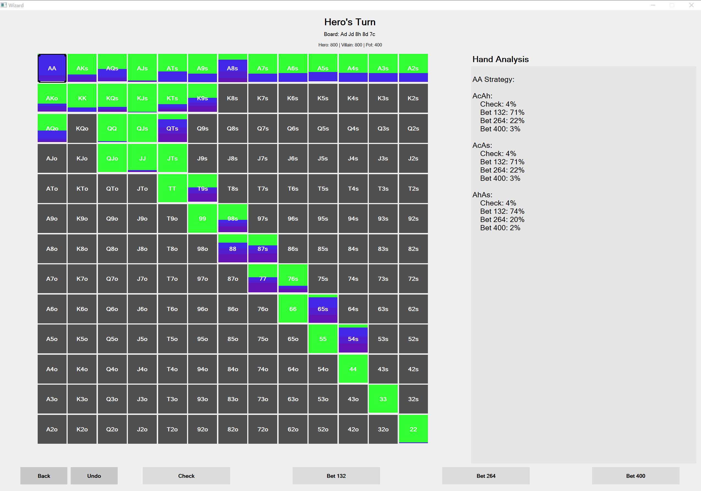

# Shark 2.0 🦈

**Shark** is a completely free (and ad-free) open-source solver that implements state-of-the-art algorithms to solve Heads-Up (HU) poker. While other solvers exist, this project had two main goals:

1. **Simplicity** – Keep the UI and usage as simple as possible.
2. **Accessibility** – Allow anyone, even those unfamiliar with poker, to use the solver with ease.

Many features seen in other solvers have been intentionally omitted to reduce clutter and cognitive load. For example:
- Bet sizes are fixed to **25%, 50%, 75%, and 100%**
- Raise sizes are limited to **50% and 100%**

These trade-offs were made to maintain a clean user experience.

> 🗂️ **Installers (.zip files) are available on the [Releases tab](https://github.com/your-repo-name/releases)**

---

## 🎮 How to Use Shark

### Page 1: Initial Setup
Input the following:
- Starting stack
- Starting pot size
- Minimum bet
- All-in threshold *(default: 0.67)*
- Number of iterations *(default: 100)*
- Minimum exploitability *(set to 0 to never stop early)*

You’ll also be asked for:
- Your position
- Villain’s position
- Pot type (e.g. single raised, 3-bet)

> ✅ Based on this, ranges are **auto-imported**. Uncheck the box to input them manually.
> There is almost NO input checking, program will crash with nonsensical inputs

---

### Page 2: Board Selection
Click to select the board cards:
- **3 cards** for flop
- **4 cards** for turn
- **5 cards** for river  
Or click "Random Flop" to auto-generate and tweak from there.

---

### Pages 3 & 4: Range Editing
Adjust **your** and **villain's** ranges.  
Auto-imported ranges are conservative (few 4-bet bluffs), so feel free to tune based on how aggressive/bluffy you or your opponent are.

---

### Page 5: Results
- View PIO-style strategy coloring
- Click a hand to see strategy for each combo
- Use dropdown to choose an action (check, bet, fold, etc.)

> ⚠️ If you select an action that occurs with low probability, solver outputs may be unreliable due to limited subtree exploration.

You’ll then be prompted to select the next board card if continuing the hand.  
Use **Undo** (bottom left) to go back one action or card.  
Use **Back** to return to inputs and solve a different game.

---

## 🪟 Windows Installation
1. Go to the [Releases tab](https://github.com/your-repo-name/releases) and download the `shark.zip` for Windows
2. Unzip the folder
3. Inside the folder, double-click `shark.exe`
4. Windows may warn you about an untrusted app — click **More Options** → **Run Anyway**

---

## 🍎 macOS Installation
> macOS is more strict with unsigned apps

1. Go to the [Releases tab](https://github.com/your-repo-name/releases) and download the mac `.zip` file
2. Download and try to open `shark` — it will say the app is untrusted
3. Go to **System Settings** → **Privacy & Security**
4. Scroll down and click **Open Anyway** under *"shark wants to run"*
5. Confirm to run the app

I’m working on getting a developer license to make this process easier in the future.

---

## 🔐 Security Note
This project is fully open source — feel free to inspect the code yourself.  
The `.zip` file build process is located in `.github/workflows/new_ci.yml`.

---

## 🛠 Developer Notes

Huge thanks to [Fossana's original solver](https://github.com/Fossana/discounted-cfr-poker-solver), which served as the foundation for this project.

### Key Improvements:
- Ported to **C++** for 10–40x speed boost with `-O3` optimizations allowing auto SIMD vectorization
- **Bug fixes** (e.g., proper chance node updates)
- Support for **asymmetric ranges** (Fossana required hero = villain)
- Added support for **flop** solving (not just turn)
- Improved **reach probability propagation**
- Different concurrency model
- Fully functional **GUI**
- Numerous quality-of-life and performance enhancements

Also uses [HenryRLee’s PokerHandEvaluator](https://github.com/HenryRLee/PokerHandEvaluator) for winner determination on showdowns.

---

## 👋 About Me

I'm a college student and built this as a side project because I wanted to learn C++ better and love Poker!  
Some future optimizations I would love to explore:
- Hand isomorphism for 2–3x speed boost
- Better GUI design and UX

I’m currently too busy to implement these — but pull requests and forks are welcome!  
If this project helped or interested you, please star the repo or reach out 🙌

**DM me** with questions about the implementation or poker solving in general. I'd love to chat.
