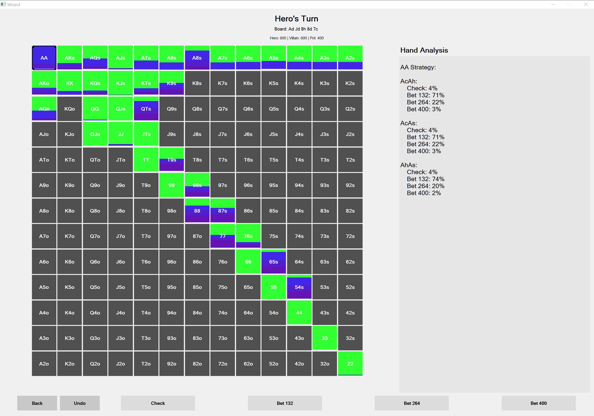

# Shark 2.0 

## Demo (old version but still 90% relevant): https://youtu.be/3Rcd4PqS9L0
## (Promotional) [LinkedIn post](https://www.linkedin.com/feed/update/urn:li:activity:7416664544271323136/)

Shark is a completely free (and ad-free) open-source solver for Heads-Up (HU) poker. My primary two goals while writing this solver was:
1. Simplicity – Keep UI Simple & Fast
2. Accessibility – Allow anyone to use the solver, even those not experienced with other solvers.

Many features seen in other solvers have been intentionally omitted to reduce clutter and cognitive load. Bet/raise sizes vary by street:
- Flop: Bet 50%, 100% | Raise 100%
- Turn/River: Bet 33%, 66%, 100% | Raise 50%, 100%

These trade-offs were made to maintain a clean user experience.

> Installers are available on the Releases tab: https://github.com/24parida/shark-2.0/releases

---

## How to Use Shark

### Page 1: Initial Setup

Input the following:
- Stack Size
- Starting Pot
- Initial Min Bet
- All-In Threshold (default: 0.67)
- Pot Type (Single Raise, 3-bet, 4-bet)
- Your Position (SB, BB, UTG, UTG+1, MP, LJ, HJ, CO, BTN)
- Their Position
- Iterations (default: 100)
- Min Exploitability % (default: 0.1%, set to 0 to never stop early)
- Thread Count (default: Your CPU cores - 1)

Options:
- Auto-import ranges – automatically loads ranges based on positions and pot type
- Force Donk Check – disables donk bets on flop (recommended for memory savings)

---

### Page 2: Board Selection
Click to select the board cards:
- 3 cards for flop (Or click "Random Flop" to auto-generate)
- 4 cards for turn
- 5 cards for river  
---

### Pages 3 & 4: Range Editing
Adjust your and villain's ranges.  
Auto-imported ranges are conservative (few 4-bet bluffs), so feel free to tune based on how aggressive/bluffy you or your opponent are.

---

### Page 5: Results
NOTE: results may take anywhere from 2s-4minutes based on range size, num iterations, and whether you are solving flop, turn, or river.
- View PIO-style strategy coloring
- Click a hand to see strategy for each combo
- Use dropdown to choose an action (check, bet, fold, etc.)

> ⚠️ If you select an action that occurs with low probability, solver outputs may be unreliable due to limited subtree exploration.

You’ll then be prompted to select the next board card if continuing the hand.  
Use Undo (bottom left) to go back one action or card.  
Use Back to return to inputs and solve a different game.

---

## Flop Solving (RAM-Saving Mode)

Flop solving is the most memory-intensive part of the game tree. To make flop solves fit in a typical laptop's RAM, Shark applies a few flop-specific constraints that greatly reduce tree size and memory usage. The below ONLY applies for flop solves.

### How the solver works for flop games (and why)

1) Strategy compression to int16  
For flop solving, strategy arrays are stored in a compressed int16 format to reduce memory usage. (Regrets are already compressed for turn & flop.)

2) Max raises per street capped to 3 before force all-in  
To prevent raise-wars from exploding the game tree, each street is capped at 3 raises. After the cap is reached, further raising is replaced by a forced all-in option.

3) Force Donk Check is defaulted to true (highly recommended)  
By default, Shark disables donk betting on flop to reduce branching and help memory usage.  
Example: if flop goes p1 check → p2 raise/bet → p1 call, then on the turn p1 is forced to check (no donk lead).  
This can be toggled off, but is highly recommended to keep enabled for flop solves.

4) Flop action space is reduced to shrink tree size  
Flop only has bet options of 50% and 100%, and a single raise option of 100% to reduce tree size. Turn/river retains all 3 bet sizes and 2 raise sizes.

---

## Windows Installation
1. Go to the Releases tab and download `shark_windows.zip`: https://github.com/24parida/shark-2.0/releases
2. Unzip the folder
3. Inside the folder, double-click shark.exe
4. Windows may warn you about an untrusted app — click More Options → Run Anyway

---

## macOS Installation
> macOS is more strict with unsigned apps

**Choose the right download for your Mac:**

| Download | For | macOS Version |
|----------|-----|---------------|
| `shark_macOS_compatible.tar.gz` | Apple Silicon (M1/M2/M3) | macOS 12 Monterey or newer |
| `shark_macOS_latest.tar.gz` | Apple Silicon (M1/M2/M3) | Latest macOS only |
| `shark_macOS_intel.tar.gz` | Intel Macs (pre-2020) | macOS 10.15 Catalina or newer |

> **Which should I pick?** If you have an M1/M2/M3 Mac, use `shark_macOS_compatible` — it works on most macOS versions. Only use `shark_macOS_latest` if you're on the newest macOS and want bleeding-edge builds.

1. Go to the Releases tab and download the correct file for your Mac: https://github.com/24parida/shark-2.0/releases
2. Double-click the `.tar.gz` file to extract it
3. Try to open `shark` — it will say the app is untrusted
4. Go to System Settings → Privacy & Security
5. Scroll down and click Open Anyway under "shark wants to run"
6. Confirm to run the app

---

## Security Note
The reason for having to trust the file is b/c to get a developer license is around $100/year for each platforms which I currently can't afford for just a side project :(.  
For anyone wrorried about security: this project is fully open source — feel free to inspect the code yourself.  
The build process is located in .github/workflows/new_ci.yml.

---

## 🛠 Developer Notes

Huge thanks to Fossana's original solver, which served as the foundation for this project:
https://github.com/Fossana/discounted-cfr-poker-solver

### Key Improvements:
- Ported to C++ for 10–40x speed boost with -O3 optimizations
- 50% memory reduction via int16 strategy compression (enables larger flop solves)
- Hand isomorphism exploits suit symmetry for ~25% fewer computations
- Intel TBB parallelization for efficient multi-core utilization
- SIMD vectorization hand checked every part that can be vectorized is (atleast on windows)
- Flop-specific optimizations: donk bet removal, raise caps, reduced action space
- Per-street bet sizing: different bet/raise options for flop vs turn/river
- Bug fixes (e.g., proper chance node updates)
- Support for asymmetric ranges (Fossana required hero = villain)
- Added support for flop solving (not just turn)
- Improved reach probability propagation
- Fully functional GUI with oceanic blue theme
- Solve caching – skips redundant computations when re-exploring
- Undo history – navigate backwards through the game tree
- Strategy export – copy ranges in PIO-compatible format
- Thread count control – configure parallelism from the UI

### Base Algorithm:
- Discounted Counter Factual Regret Minimization
- Full multithreading support

Also uses HenryRLee’s PokerHandEvaluator for winner determination on showdowns:
https://github.com/HenryRLee/PokerHandEvaluator

---

## 👋 About Me

### About This Project
I’m a college student who built this as a side project to deepen my C++ skills—and because I love poker!

### Future Optimizations I'd Like to Explore
- Improved GUI design and overall UX
- Additional bet sizing configurations
- Preflop solver integration

Pull requests and forks are welcome!

If you found this project helpful or interesting, please star the repo or reach out 🙌

DM me with questions about the implementation or poker solving in general. I'd love to chat.
